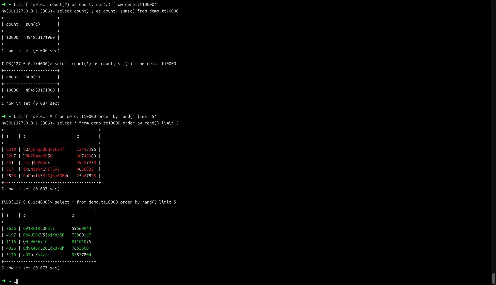
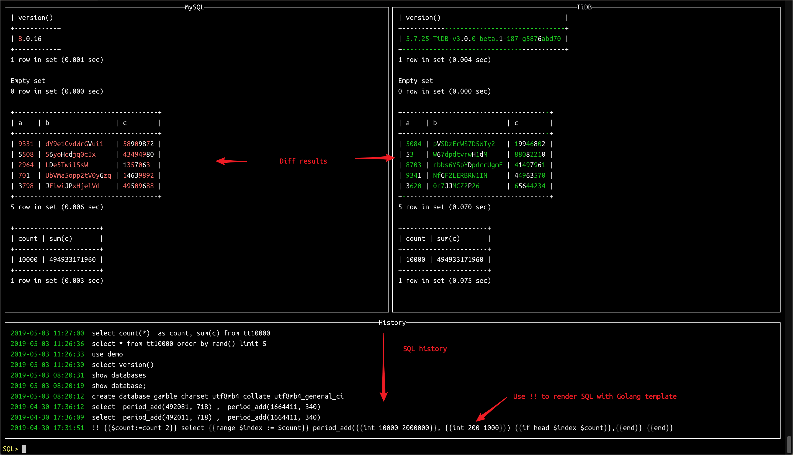

# tidiff

## Overview

`tidiff` is a diff tool that sends the same SQL statement to TiDB and MySQL for processing, then compares the results and highlights the differences. You can use it in the following scenarios: 

- Checking whether a SQL statement in TiDB is compatible with MySQL

- Generating the same extra workload for both MySQL and TiDB when it comes to the case that a large amount of data (e.g. 1 million rows of data) is needed to reproduce the BUG.


## Sample usages

The examples assume that you have already started the local MySQL and TiDB servers. The servers can be logged in with `root` username and an empty password. 

```
 ~ tidiff -h
NAME:
tidiff - Execute SQL in TiDB and MySQL and returns the results

USAGE:
tidiff [global options] command [command options] [arguments...]

VERSION:
0.0.1

DESCRIPTION:
Used to compare the result different in MySQL and TiDB for the same SQL statement

COMMANDS:
    help, h  Shows a list of commands or help for one command

GLOBAL OPTIONS:
--mysql.host value      MySQL host (default: "127.0.0.1")
--mysql.port value      MySQL port (default: 3306)
--mysql.user value      MySQL username (default: "root")
--mysql.password value  MySQL password
--mysql.db value        MySQL database
--mysql.options value   MySQL DSN options (default: "charset=utf8mb4")
--tidb.host value       TiDB host (default: "127.0.0.1")
--tidb.port value       TiDB port (default: 4000)
--tidb.user value       TiDB username (default: "root")
--tidb.password value   TiDB password
--tidb.db value         TiDB database
--tidb.options value    TiDB DSN options (default: "charset=utf8mb4")
--log.diff value        Log all query diff to file
--help, -h              show help (default: false)
--version, -v           print the version (default: false)
```

- Create a `demo` database for MySQL/TiDB

  `tidiff 'create database demo charset utf8mb4 collate utf8mb4_general_ci'`

- Create a `demo.tt10000` table for MySQL/TiDB

   `tidiff 'create table demo.tt10000 (a bigint(20) not null auto_increment primary key, b varchar(20) not null, c bigint(20))'`

   or
   
   `tidiff --mysql.db demo --tidb.db demo 'create table tt10000 (a bigint(20) not null auto_increment primary key, b varchar(20) not null, c bigint(20))'`

- Insert 10,000 rows of data into the `demo.tt10000` table using Golang template syntax

   `tidiff '! {{$count:=count 10000}} insert into demo.tt10000 values {{range $index := $count}} (NULL, "{{varchar 20}}", "{{int 100000 100000000}}"){{if head $index $count}},{{end}}{{end}}'`

- Check the number of rows in the `demo.tt10000` table and get the sum for column `c`

   `tidiff 'select count(*) as count, sum(c) from demo.tt10000'`

- Select 5 random rows from the `demo.tt10000` table

   `tidiff 'select * from demo.tt10000 order by rand() limit 5'`

- Here is the screenshot of the operation above. The result differences are displayed in `diff` format.

  

    You can use the command line mode as downstream pipeline, for example `randgen | xargs tididff`. The SQL statement should be quote with ` instead of `.

## Interactive Mode

`tidiff` provides an interactive mode which records SQL statements execution history so as to run a SQL statement repeatedly. 

- To enable the interactive mode, enter the `tidiff --mysql.db test --tidb.db test` without a SQL statement.

- If the interactive mode includes `--log.diff` parameters like `tidiff --log.diff /path/to/diff.log`, then all the results will be saved into the log file. The difference will also be highlighted when you view the results using the `cat` command.  

- If a SQL statement that includes some Golang template fails, the error part will be highlighted with `/* error message */` at the end of the statement.  

    

- Shortcuts for interactive mode

  - SQL Input Panel

    - Use `Enter` to execute SQL statements. If a SQL statement begins with `!` , then Golang template is firstly used, where you can embed statements or expressions that generate random data. If a SQL statement begins with `!!`, the generated SQL statement will appear on the output panel. The SQL statement rendered will not be output in the output panel by default. 

    - Use `TAB` to switch between panels. 

    - Use `Up/Dn` to fast shift the focus to the `History` panel.

  - MySQL/TiDB Output Panel 

    - Use `Up/Dn` to turn page up or down.

    - Use `TAB` to switch between panels.
    
    - Use `ESC` and return to the `SQL input` panel. 

  - History Panel 

    - Use `Up/Dn` to fast shift the focus to the `SQL input` panel. 
    
    - Select a history entry and use `Enter` to fill it in the `SQL input` panel for later editing and executing.

    - Use `ESC` and return to the `SQL input` panel.
 

## Golang template

Here only introduces usages of `:=`, `range`, and `if`, and the functions provided in `tidiff`. All SQL statements must start with `!` so that `tidiff` can render them using the Golang template. 

- `:=` Defines a template variable `$rand`. The value must be çan integer within the range of `10000- 100000`.

  ```
  $ tidiff '! {{$rand:=int 10000 100000}} select {{$rand}} < 50000'
  MySQL(127.0.0.1:3306)> select 78081 < 50000
  +---------------+
  | 78081 < 50000 |
  +---------------+
  | 0             |
  +---------------+
  1 row in set (0.001 sec)

  TiDB(127.0.0.1:4000)> select 78081 < 50000
  +---------------+
  | 78081 < 50000 |
  +---------------+
  | 0             |
  +---------------+
  1 row in set (0.003 sec)
  ```

- Sample usages for `range` and `if` 

  ```
  $ tidiff '! {{$counter:=count 5}} select {{range $index:=$counter}} {{int 100 1000}} {{if head $index $counter}},{{end}}{{end}}'
  MySQL(127.0.0.1:3306)> select  681 , 187 , 147 , 759 , 581
  +-----------------------------+
  | 681 | 187 | 147 | 759 | 581 |
  +-----------------------------+
  | 681 | 187 | 147 | 759 | 581 |
  +-----------------------------+
  1 row in set (0.002 sec)

  TiDB(127.0.0.1:4000)> select  681 , 187 , 147 , 759 , 581
  +-----------------------------+
  | 681 | 187 | 147 | 759 | 581 |
  +-----------------------------+
  | 681 | 187 | 147 | 759 | 581 |
  +-----------------------------+
  1 row in set (0.005 sec)
  ```

   Generate 5 random values through Golang template

     a. First define a variable as a cycle counter `{{$counter:=count 5}}`
    
    b. Then use `{{range $index:=$counter}}` to traverse `$counter`
    
    c. Output a `,` if it’s not the last element of `$counter` until a valid SQL statement is constructed.   
    ```
    tidiff '! {{$counter:=count 5}}
    select
        {{range $index:=$counter}}
            {{int 100 1000}}
            {{if head $index $counter}},{{end}}
        {{end}}'
    ```


- Built-in functions provided by `tidiff`

  - `count n`: returns the counter with `n` elements 

  - `first $index $counter`: returns `true` if `$index` is the first element of `$counter`
  
  - `last $index $counter`: returns `true` if `$index` is the last element of `$counter`

  - `head $index $counter`: returns `true` if `$index` is not the last element of `$counter`

  - `tail $index $counter`: returns `true` if `$index` is not the first element of `$counter`

  - `int min max`: returns an integer within the range of `[min, max)`

  - `char length`: returns a random string with a length of  `length` 

  - `varchar length`: returns a random string with the length within the range of `[length/2, length)`

## Configuration

`tidiff` supports saving parameters to the configuration file as key-value pairs. The path of the configuration file is  `~/.config/tidiff/config`. See the following sample configuration file: 

```
mysql.host = 192.168.4.30
mysql.port = 3306
mysql.user = root
mysql.password = 12345678
mysql.db = test
mysql.options = charset=utf8mb4
tidb.host = 192.168.4.31
tidb.port = 4000
tidb.user = root
tidb.password = 1111
tidb.db = test
tidb.options = charset=utf8mb4
```
