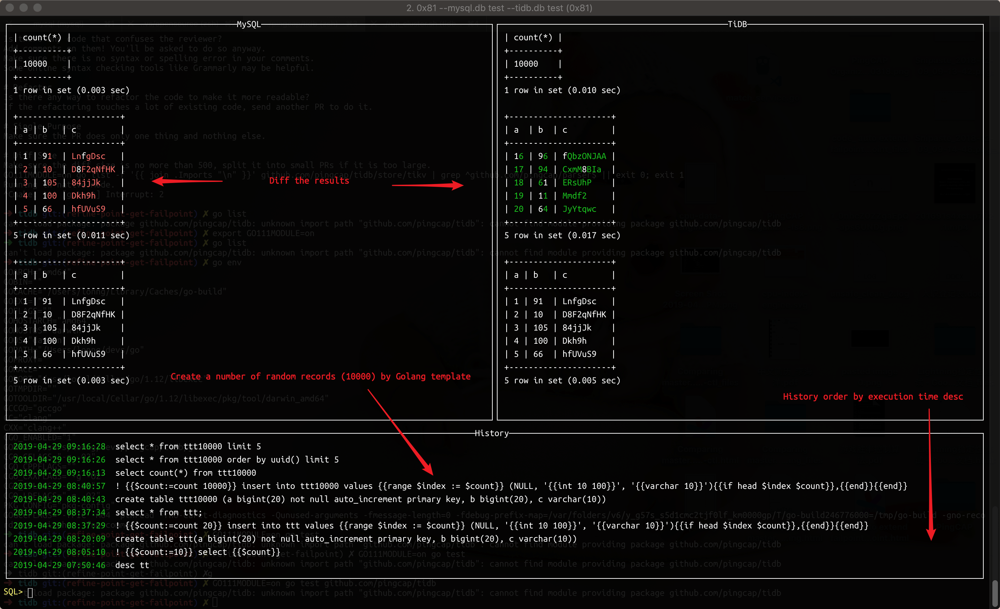

# tidiff

A tool to compare the result set difference of the same query in TiDB/MySQL

## Command Line Mode

DEMO

```sh
tidiff 'show tables'
# ceate a table in test database
tidiff 'create table tt1000 (a bigint(20) not null auto_increment primary key, b varchar(20) not null, c bigint(20))'
# random generate 1000 rows in the `tt1000`
tidiff '! {{$count:=count 20}} insert into tt1000 values {{range $index := $count}} (NULL, "{{varchar 20}}", "{{int 100000 100000000}}"){{if head $index $count}},{{end}}{{end}}'
# same results
tidiff 'select * from tt1000 limit 5'
# results with diff
tidiff 'select * from tt1000 order by rand() limit 5'
```

You can use the command line mode as downstream pipeline, e.g: `randgen | xargs tididff`. The SQL statement should be quote with `'` instead of `"`.



## UI Mode Shortcuts

- `TAB` switch focus in different panel
- `ESC` focus on SQL input panel
- `UP`  focus on the previous history item
- `DOWN` focus on the next history item
- `ENTER` select current selected history item

## Features

- Record the histories
- Highlight the diff in result sets
- Support `!` directive, which enable the template support for a query, e.g:

    `! {{$count:=count 10}} insert into t values {{range $index := $count}}({{int 10 100}}){{if head $index $count}},{{end}}{{end}}`
    `!! select period_add({{ int 10000 200000}}, {{int 100 10000}})` will show the generated sql, e.g: `period_add(108081, 7987)`
    
- Template functions

    - `count n` returns a slice contains `n` elements
    - `first index slice` returns true if `index` is the first element of the `slice`
    - `last index slice`returns true if `index` is the last element of the `slice`
    - `head index slice`returns true if `index` is the head element of the `slice`
    - `tail index slice`returns true if `index` is the tail element of the `slice`
    - `int min max`returns a rand integer which in the range `[min, max)`
    - `char length`returns a rand string which length is `length`
    - `varchar length`returns a rand string which length in `[length/2, length)`
    
## Examples

1. `create table ttt(a bigint(20) not null auto_increment primary key, b bigint(20), c varchar(10))`
2. `! {{$count:=count 20}} insert into ttt values {{range $index := $count}} (NULL, '{{int 10 100}}', '{{varchar 10}}'){{if head $index $count}},{{end}}{{end}}`

## Config file

You can provide default values from config file `~/.config/tidiff/config`

```
mysql.host = 192.168.4.30
mysql.port = 3306
mysql.user = root
mysql.password = 12345678
mysql.db = test
mysql.options = charset=utf8mb4
tidb.host = 192.168.4.31
tidb.port = 4000
tidb.user = root
tidb.password = 1111
tidb.db = test
tidb.options = charset=utf8mb4
```